# Space X Launches Mobile App

## Overview

This is a React Native application developed for Android phones. It leverages the Space X V3 launches API to display historical and future launches to the user.

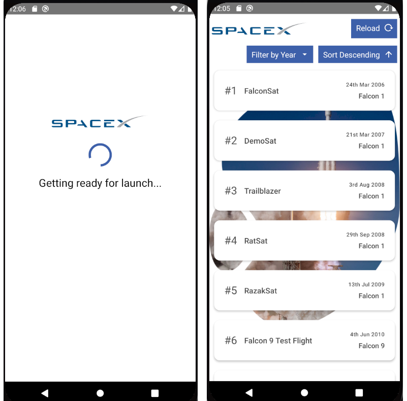

## User stories

- As a user, I want the ability to load the full list of SpaceX launches from the SpaceX API
- As a user, I want the ability to reload the data to see any new changes
- As a user, I want the ability to filter the launch list by year
- As a user, I want the ability to sort all launches by date (ascending/descending)

## Skeleton

Initial web designs were used for the purpose of designing some basic wireframes for this project.

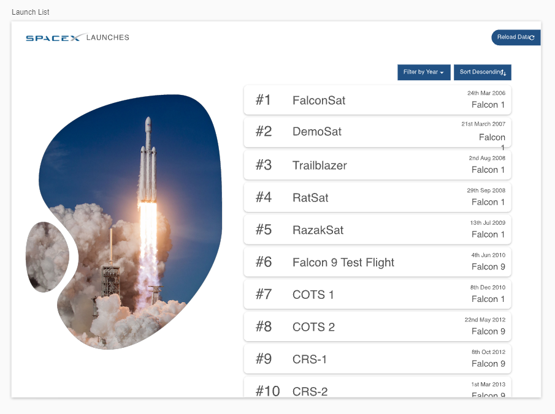

The below laucnhes screen skeleton highlights the core functionality of the project which includes, reloading the list of launches, filtering the list, sorting the list and displaying list items.

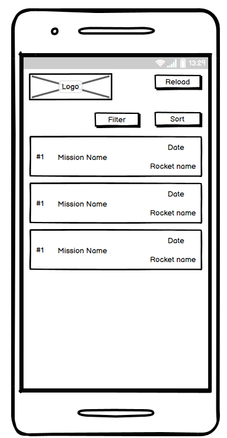

## Screens

### Home

The home screen is used to buffer the application and give space for future development of login / registration functionality. The internals of this screen pre-fetch the launches list from the Space X launches API and store them in a global state ready to be consumed by the launches screen. The user is meant to be informed by this screen that a process is running in the background.

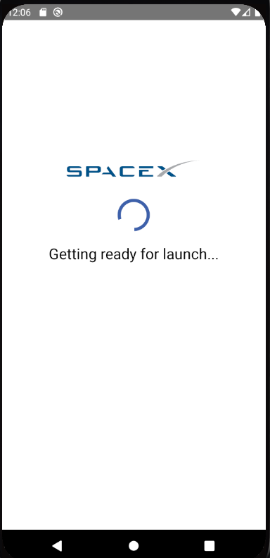

### Launches

The launches screen gives the user the ability to view launches, sort the launches, filter the launches and also refresh the list of launches.

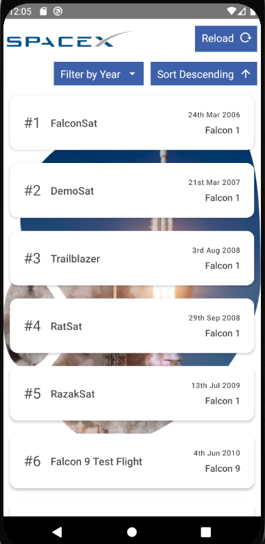

## Features

### Implemented

__Logo__

The logo is a component that can be rendered on each page without having to build the view define the proportions, etc.

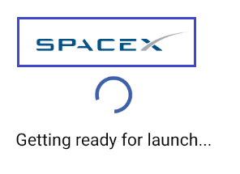

__Home screen loading__

The loading section on the home screen is used to inform the user that data is being processed in the background ready for a smooth user experience.

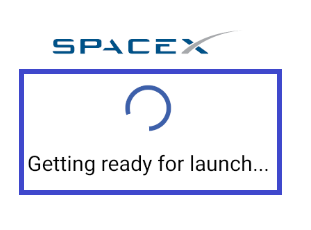


__Reload button__

The reload button gives the user the ability to refresh the underlying data of the launches list and update the state with the latest fetch from the launches API.

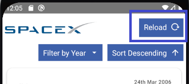

__Filter by year button__

The filter by year button gives the user the ability to filter the launches list by a given year. A menu appears with only the years defined in the launches list - see below.

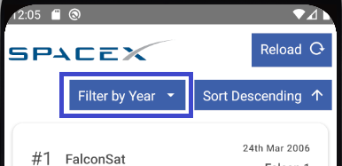

__Filter by year menu__

The filter by year menu is a list of years that were passed from the launches list. After a year is selected the launches list is filtered to only show launches with the given year. Additionally, a chip with the year is displayed, indicating the selected year. The user may also change the year by selecting the filter by year button again and choosing a different year. The chip is then updated. Alternatively, the chip close button may be pressed to return the list to its original state.

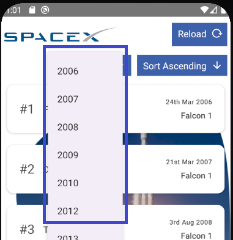

__Sort button__

The sort button gives the user the ability to sort the displayed list is ascending or descending order. If the list is filtered then only the filtered list is sorted, not the underlying launches.

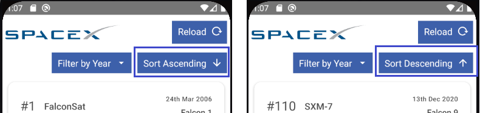

__Launch list__

The launch list defines all the launches that are fetched from the API and displays them as a scrollable list in the UI.

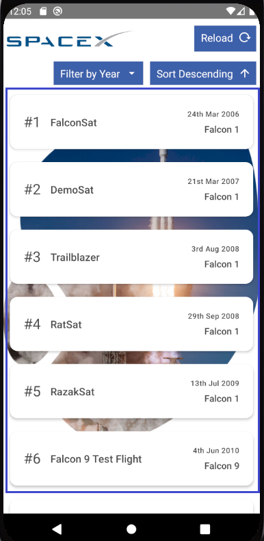

__Launch details__

The launch details component renders the details provided from the launches state. This includes the launch number, the mission name, the launch date and the rocket name.

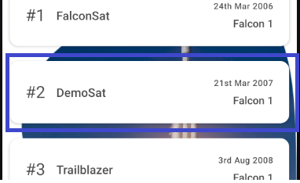

__Background image__

The background image can be seen statically behind the launch list. It provides some added element to the list while the user scrolls through the launches.


### To be implemented

1. Error handling globally and per screen where appropriate, e.g. when an API call fails display a error badge / modal.
2. Code performance improvements. The application can lag due to the number of items in the list. The FlatList component is meant to aid in performance issues relating to the length of the list but this can be improved internally through code improvement.

## Running locally

It is assumed that you are familiar with running React Native projects through the terminal, if not you can find environment setup instructions [here](https://reactnative.dev/docs/environment-setup) for __react native cli quickstart__.

Navigate into the root of the project, with an android emulator running, and run `npx react-native run-android`.

## Technologies used

1. React Native
2. React native paper
3. Redux
4. Typescript
5. Husky
6. Jest

For an up-to-date list of packages used please see the __package.json__ file at the root of this repository.

## Testing

### Unit tests

I wanted code coverage to be above 75% for this project and for components to be covered by either a validation against rendered children or a snapshot. You may check for code coverage by running `yarn jest --coverage` or `npm run test`. Further tests should cover the remainder of the components and validate against specific values within the component. Any deficiencies in unit tests are covered by manual testing. I have not committed the code coverage report, instead included the terminal output overview. You may run the unit tests to generate specific reports as desired.

```shell
-------------------------|---------|----------|---------|---------|-------------------
File                     | % Stmts | % Branch | % Funcs | % Lines | Uncovered Line #s 
-------------------------|---------|----------|---------|---------|-------------------
All files                |   80.43 |     62.5 |   57.14 |   81.81 |                   
 assets/img              |     100 |      100 |     100 |     100 |                   
  launch-home.png        |     100 |      100 |     100 |     100 |                   
 components              |       0 |        0 |       0 |       0 |                   
  index.tsx              |       0 |        0 |       0 |       0 |                   
 components/Background   |     100 |      100 |     100 |     100 | 
  Background.tsx         |     100 |      100 |     100 |     100 |                   
 components/FilterButton |      60 |      100 |      50 |   66.66 | 
  FilterButton.tsx       |      60 |      100 |      50 |   66.66 | 55-57
 components/LaunchItem   |     100 |      100 |     100 |     100 | 
  LaunchItem.tsx         |     100 |      100 |     100 |     100 | 
 components/LoadingModal |   66.66 |      100 |       0 |   66.66 | 
  LoadingModal.tsx       |   66.66 |      100 |       0 |   66.66 | 18
 components/Logo         |   66.66 |      100 |       0 |   66.66 | 
  Logo.tsx               |   66.66 |      100 |       0 |   66.66 | 11
 components/ReloadButton |   66.66 |      100 |       0 |   66.66 | 
  ReloadButton.tsx       |   66.66 |      100 |       0 |   66.66 | 16
 components/SortButton   |   77.77 |       50 |      50 |   77.77 | 
  SortButton.tsx         |   77.77 |       50 |      50 |   77.77 | 29-30
 utils                   |     100 |      100 |     100 |     100 | 
  date.util.ts           |     100 |      100 |     100 |     100 | 
-------------------------|---------|----------|---------|---------|-------------------

Test Suites: 5 passed, 5 total
Tests:       5 passed, 5 total
Snapshots:   2 passed, 2 total
Time:        11.136 s
Ran all test suites.
Done in 13.49s.
```

### Manual testing

__Testing user stories__

- As a user, I want the ability to load the full list of SpaceX launches from the SpaceX API

In the features section it is demonstrated that the user has the ability to view all past and future launches. However, launches seem to stop around the end of 2020. I looked into the other endpoints and this indeed seems to be the case. The launches API is meant to return all launches - past, present and future - and with this in mind the the list will also have this ability.

- As a user, I want the ability to reload the data to see any new changes

The user has the ability to reload the data and is informed that this process is underway with the loading modal - below.

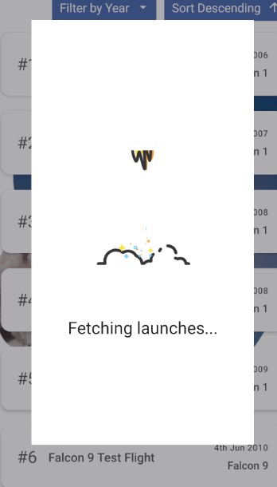

- As a user, I want the ability to filter the launch list by year

In the features section it is demonstrated that the user has the ability to filter the list by year by interacting with the filter button.

- As a user, I want the ability to sort all launches by date (ascending/descending)

In the features section it is demonstrated that the user has the ability to sort the displayed the list in ascending or descending order.

__Testing functionality__

Each feature defined in this readme file was tested manually. There is one known bug where the displayed text for the sorting of this list remains unchanged after pressing the button. I currently believe this is due to performance issues of my environment and is tricky to reproduce consistently.

A testing table is given below for the process I went through to test the application manually.

| Feature         | Test     | Passed / Failed |
|--------------|-----------|------------|
| Home screen load | I reloaded the application and waited for the launches list to be displayed | Passed |
| List render | On navigation the the launches list I want to see a list of launches | Passed |
| Reload button | Pressing the reload button displays a loading modal | Passed |
| Reload button | Pressing the reload button makes and API call | Passed |
| Filter button | Pressing the filter button brings up a menu-list | Passed |
| Menu item | Pressing a year in the filter list filters the list to that given year | Passed |
| Menu item | Pressing a year in the filter list renders a chip with the year on the UI | Passed |
| Chip close | Pressing the close icon on the chip removes the filter on the list | Passed |
| Sort button | Pressing the sort button changes the sort display of the list | Passed |

## Acknowledgements

1. Rocket GIF, found on gifimage.net, for the loading component.